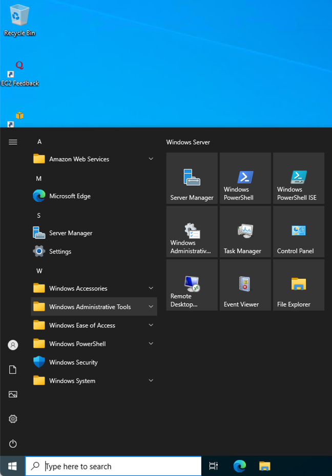
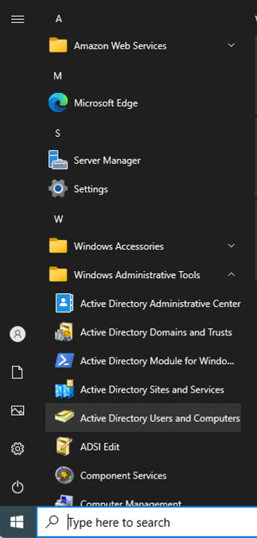
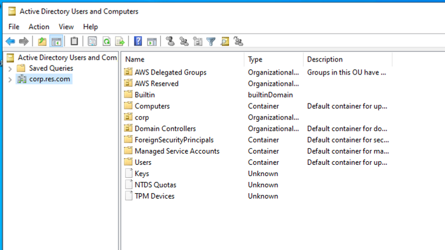
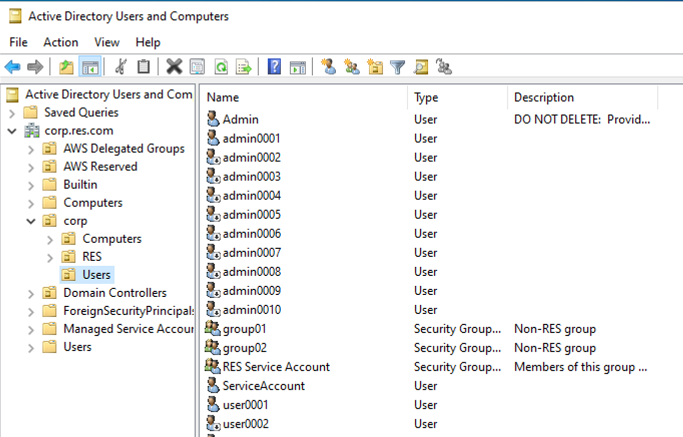
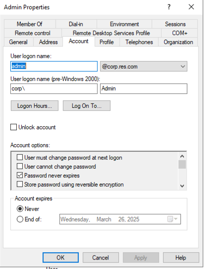
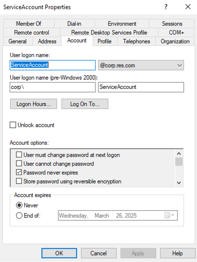

# RES Integration

[Research and Engineering Studio](https://aws.amazon.com/hpc/res/) (RES) is an open source, easy-to-use web-based portal for administrators to create and manage secure cloud-based research and engineering environments.
It enables users to self-provision virtual desktops.
It currently doesn't have integrated support for an HPC cluster.
We'll describe here how to integrate RES virtual desktops with one or more ParallelCluster clusters and use them from the RES desktops.

First you will need to deploy RES.
The easiest way is to [deploy the demo environment](https://docs.aws.amazon.com/res/latest/ug/create-demo-env.html) which provides all of the prerequisites and completely automates the deployment.
If you want to use an existing VPC or Active Directory, then you will need to follow the instructions to [deploy the product](https://docs.aws.amazon.com/res/latest/ug/deploy-the-product.html).

## RES Deployment

The `res` directory contains customized CloudFormation templates that allows you to deploy the RES prerequisites (VPC with customizable CIDR range, EFS home file system, Active Directory, default admins and users) and RES separately.
The templates are based on the RES demo environment that uses Keycloak for single sign on, but allow the CIDR range to be customize and for the batteries included (BI) and RES stacks to be deployed separately.

This allows you to easily upgrade the RES stack to new versions without affecting the BI stack.

Clone the repo and upload the templates to your S3 bucket for deployment.

```
cd aws-eda-slurm-cluster/res
./upload-res-templates.py --s3-bucket <your-bucket> --s3-base-key <your-bucket-key>
```

This will output the quick links to deploy the BI and RES stacks.

## RES Setup

After you've deployed RES, you need to configure it so that the remote desktops can be used as external login nodes and so that they have access to any file systems that you created.

### Onboard your file systems

RES natively supports EFS, FSx for NetApp Ontap, and FSx for Lustre file systems.
It can create them for you or you can onboard existing file systems.

* Expand **Environment Management**
* Click **File Systems**
* Click **Onboard File System** or **Create File System**

### Create RES Project

* Expand **Environment Management**
* Click **Projects**
* Click **Create Project**
* Fill in the required fields.
* Add any file systems that you created so they will be automatically mounted on the desktops that belong to the project.
* Expand **Advanced Options** under **Resource Configurations** and add the **SlurmLoginNodeSG** so that it will be attached automatically to the remote desktop so they can access the external file systems and slurm clusters.
* Add the groups and users that can use the project.

### Give the project access to software stacks

Next, you'll need to give the project access to a Software Stack.
You can either create a new Software Stack or update an existing one.

* Select **Software Stacks** under **Session Management**.
* Select an existing stack like the RHEL 8 stack
* Select **Actions**, **Edit Stack**.
* Select your project under Projects and enable it to use the stack.

### Create virtual desktop

Now you can create a virtual desktop using the project that you just created.

* Select **My Virtual Desktops** under **Desktops**.
* Click **Launch New Virtual Desktop**
* Give it a descriptive name, select the project, operating system, and software stack.
* I suggest using a t3 instance for virtual desktops, such as a t3.large. If you need more cores or memory you will use your ParallelCluster compute nodes.
* I usually increase the storage size to 20GB so I can install additional packages.
* Click **Submit** and then wait for the desktop to be provisioned. You may need to refresh the page to update the desktop status.

You can switch to the EC2 console to verify that the instance has been launched and that it has the required security group attached.

## ParallelCluster Configurattion

Integration with [Research and Engineering Studion (RES)](https://docs.aws.amazon.com/res/latest/ug/overview.html) is straightforward.
You simply specify the **--RESStackName** option for the `install.sh` script or add the **RESStackName** configuration parameter
to your configuration file.
The install script will set the following configuration parameters based on your RES environment or check them if you have them set to make sure they are consistent
with your RES environment.
The intention is to completely automate the deployment of ParallelCluster and set up the RES environment so that it can easily be used.

| Parameter | Description | Value
|-----------|-------------|------
| VpcId     | VPC id for the RES cluster | vpc-xxxxxx
| SubnetId  | Subnet in the RES VPC. | subnet-xxxxx
| slurm/ExternalLoginNodes | Information of instances to be configured as external login nodes |
| slurm/DomainJoinedInstance | Tags of cluster-manager which will be used to create users_groups.json |
| slurm/storage/ExtraMounts | The mount parameters for the /home directory. This is required for access to the home directory. |
| slurm/SlurmCtl/AdditionalSecurityGroups | Security group that allows access to EFS /home |
| slurm/InstanceConfig/AdditionalSecurityGroups | Security group that allows access to EFS /home |

You must also create security groups as described in [Security Groups for Login Nodes](deployment-prerequisites.md#security-groups-for-login-nodes).
You must either specify **AdditionalSecurityGroupsStackName** or specify the SlurmHeadNodeSG in the `slurm/SlurmCtl/AdditionalSecurityGroups` parameter and the SlurmComputeNodeSG in the `slurm/InstanceConfig/AdditionalSecurityGroups` parameter.

When you specify **RESStackName**, a lambda function will run SSM commands to create a cron job on a RES domain joined instance to update the users_groups.json file every hour. Another lambda function will also automatically configure all running VDI hosts to use the cluster.

The following example shows the configuration parameters for a RES cluster with a stack named res-eda.

```
---
#====================================================================
# EDA Slurm cluster for RES using ParallelCluster
#
# Defaults and valid configuration options are in source/config_schema.py.
# Command line values override values in the config file.
#====================================================================

StackName: res-eda-pc-3-9-1-rhel8-x86-config

Region: <region>

SshKeyPair: <key-name>

AdditionalSecurityGroupsStackName: res-eda-SlurmSecurityGroups

RESStackName: res-eda

ErrorSnsTopicArn: <topic-arn>

TimeZone: 'US/Central'

slurm:
  ParallelClusterConfig:
    Version: '3.10.1'
    Image:
      Os: 'rhel8'
    Architecture: 'x86_64'
    Slurmdbd:
      SlurmdbdStackName: pcluster-slurm-dbd-res-eda-3-10-1

  SlurmCtl: {}

  # Configure typical EDA instance types
  # A partition will be created for each combination of Base OS, Architecture, and Spot
  InstanceConfig:
    UseSpot: true
    NodeCounts:
      DefaultMaxCount: 10
```

## Connect to the virtual desktop

When the cluster deployment finishes you are ready to run jobs from your RES DCV desktop.

## Create custom AMI for virtual desktops

Connect to your virtual desktop and install packages, software, configure ParallelCluster clusters, mount file systems, and whatever else you need for your project.
You'll normally require root access to do this.
When you are done, remove the following files or else new virtual desktops created from the image will fail to provision.

```
rm /root/bootstrap/semaphore/*.lock
```

## Environment Password Management

The RES environment has 2 special AD users that it uses.
The default AD password policy requires passwords to be changed every 30 days.
If you don't change them, then the passwords will expire and the RES web portal will stop working.
You can prevent this by manually resetting the passwords in AD or you can set the passwords for these
2 users to never expire.

The admin users are:

* Admin
* ServiceAccount

Their passwords are stored in Secrets Manager.

Make sure that you follow your company's security policies on how you manage these users' passwords.

### Reset Admin User passwords

Retrieve the password for the user in Secrets Manager.
Go to the AD console and reset the user's password using the same password.
You can also update to a new password, save it in Secrets Manager, and then update the password in AD.

### Change the Password Policy in AD

Use a Windows RDP client to connect to the AdDomainWindowsNode as the Admin user using the password from Secrets Manager.

Click the Windows start button and find the Windows Administrative tools.



Expand and double click on Active Directory Users and Computers.



Expand the corp.res.com.



Then expand corp and select Users.



Double click on the Admin user, select the Account tab, and check the box for "Password never expires".
Click Apply and OK.



Do the same for the ServiceAccount user.



Log out and stop the AdDomainWindowsNode instance.
